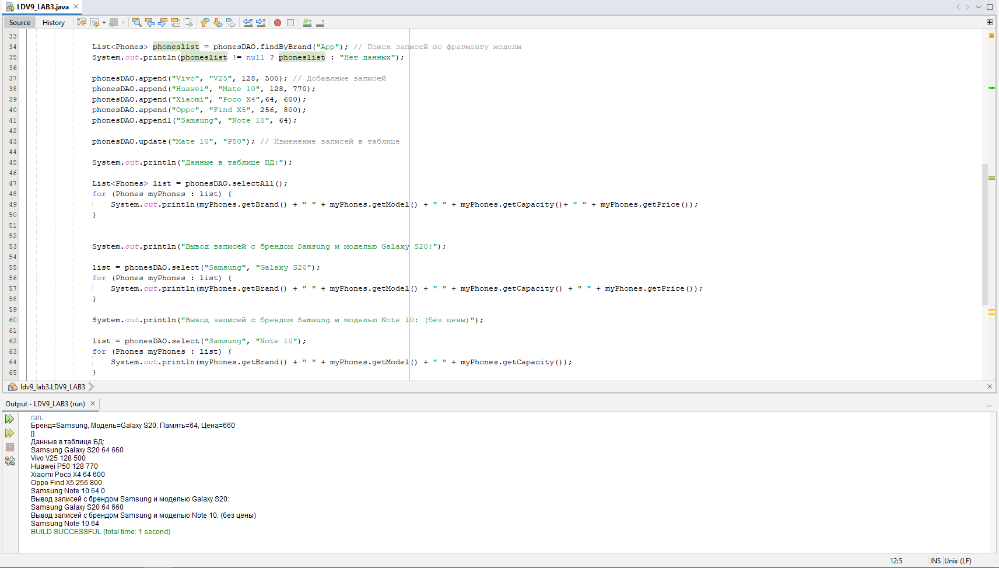

# LDV9_LAB3_JavaBeans

Практическая работа №3 Промышленное программирование <br />
**Выполнил: Лось Д.В, Группа ИС-402**



Скрипт для создания таблицы:
```
CREATE TABLE IF NOT EXISTS `ldv9_lab3`.`phones` (
  `id` INT(11) NOT NULL AUTO_INCREMENT,
  `brand` VARCHAR(45) NULL DEFAULT NULL,
  `model` VARCHAR(45) NULL DEFAULT NULL,
  `capacity` INT(11) NULL DEFAULT NULL,
  `price` INT(11) NULL DEFAULT NULL,
  PRIMARY KEY (`id`))
ENGINE = InnoDB
AUTO_INCREMENT = 85
DEFAULT CHARACTER SET = latin1
```
